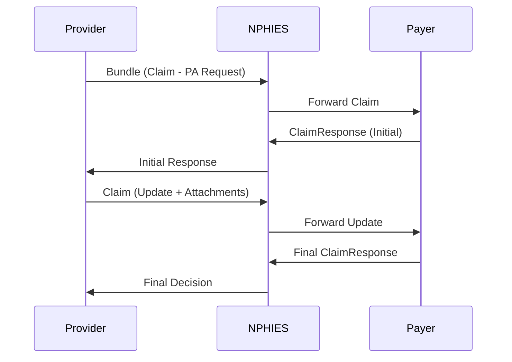

# NPHIES Prior Authorization – Complete Technical Documentation (English)
https://portal.nphies.sa/ig/usecase-prior-authorizations.html

This document is a **fully consolidated, authoritative, and FHIR-aligned specification** for the **NPHIES Prior Authorization Use Case** (based directly on the official NPHIES Healthcare Financial Services IG: Prior‑Authorization page).

This file focuses exclusively on **Prior Authorizations** — nothing else. It reflects the exact workflow, message structures, profiles, extensions, and error/queue behavior described in the official guide.

---

# 0. Source and scope

Source: NPHIES Healthcare Financial Services IG — **Use Case: Prior-Authorization**. (See the official page: `Prior-Authorization`).

Scope: Prior Authorization only — Institutional, Professional, Pharmacy, Dental, and Vision authorizations.

---

# 1. Overview

Prior Authorization (PA) enables healthcare providers to obtain approval from a Health Insurance Company (HIC) before delivering services. Providers submit a PA Request to the NPHIES gateway (FHIR `Bundle.type = message`) → NPHIES validates and forwards to the insurer/TPA → payer adjudicates and responds with a Prior Authorization Response.

If approved, the insurer issues an authorization reference (`ClaimResponse.preAuthRef`) to be used later when submitting claims for the authorized services.

---

# 2. Actors

| Actor               | Role                                                                                                                               |
| ------------------- | ---------------------------------------------------------------------------------------------------------------------------------- |
| Provider (HCP)      | Creates & submits PA Request; supplies supporting info when requested                                                              |
| NPHIES Gateway      | Validates FHIR structure/business rules; forwards messages; stores queued responses; emits `bundle.meta.tag` when pended by NPHIES |
| Payer (Insurer/TPA) | Adjudicates request (auto/manual); returns ClaimResponse (initial/partial/final)                                                   |

---

# 3. Key Behaviors & Timeouts

* **Real-time transactions:** If the payer supports automated adjudication, a complete response may be returned in the same session.
* **Non-real-time transactions:** If manual review is required, the payer may respond with `outcome='queued'` or `outcome='partial'` and later send `outcome='complete'`.
* **NPHIES delivery failure:** If NPHIES cannot deliver the request to payer within one minute, NPHIES will pend the request and return a response to the provider indicating the request was received and will be delivered later. Pended responses issued by NPHIES include a `bundle.meta.tag` to indicate `nphies-generated`.
* **Polling:** Providers should poll NPHIES to retrieve deferred responses (see Polling use case). Delayed responses are stored (pended) and retrievable by the provider.

---

# 4. Message Envelope Requirements

* All Prior Authorization exchanges MUST be sent as a **FHIR Bundle** with:

  * `Bundle.type = message`
  * **First entry** in the bundle MUST be a `MessageHeader` resource.
  * `MessageHeader.eventCoding.code` values:

    * **Request:** `priorauth-request`
    * **Response:** `priorauth-response`
* NPHIES-specific profiles must be used for each resource (the IG provides `nphies` profiled resources). See Artifacts for profile URIs.

---

# 5. Authorization Profiles (choose one per request)

The request must include one of the following NPHIES Authorization profiles (profiled resource representing the authorization request content):

* `Nphies Authorization Institutional` (hospital/inpatient/daycase)
* `Nphies Authorization Professional` (outpatient/provider services)
* `Nphies Authorization Pharmacy` (medications)
* `Nphies Authorization Dental` (major dental procedures)
* `Nphies Authorization Vision` (optical/eye surgeries)

These are provided as nphies‑profiled resources in the IG Artifacts and are required for proper processing by NPHIES and payers.

---

# 6. Bundle Content — Prior Authorization Request

Minimum bundle structure (order matters: MessageHeader first):

* `MessageHeader` (eventCoding = `priorauth-request`)
* NPHIES Authorization profile resource (one of the profiles above)
* `Coverage` (Nphies Coverage profile)
* `Patient` (Nphies Patient profile)
* `Organization` (Provider)
* `Organization` (Insurer)
* `Practitioner` (requesting clinician)
* `Encounter` (one of the nphies encounter auth profiles appropriate to the authorization type)
* [Any additional resources such as Binary, supportingInfo, Provenance]

Notes:

* The IG uses a “dynamic authorization file” concept — the authorization is a dynamic list of planned and performed services managed by the insurer.
* All resource instances should conform to the NPHIES profiles in the Artifacts section of the IG.

---

# 7. Bundle Content — Prior Authorization Response

Minimum bundle structure (MessageHeader first):

* `MessageHeader` (eventCoding = `priorauth-response`)
* `Nphies Authorization Response` (profiled response resource; often implemented as ClaimResponse-like resource in IG)
* `Coverage` (to confirm policy)
* `Patient`
* `Organization` (Provider)
* `Organization` (Insurer)
* Optional: `Organization (PolicyHolder)`, `CommunicationRequest`, `Notes`, and other resources as needed

Important: the response includes adjudication outcome and, when applicable, `preAuthRef` (the authorization reference to be used later in claims).

---

# 8. Common Extensions & Important Elements (explicit from IG)

* **ClaimResponse.preAuthRef** — The authorization reference number returned by the payer on initial approval.
* **Eligibility Response Extension** — If an eligibility check was performed prior to authorization, include `Eligibility Response` or `Eligibility Offline Reference` and `Eligibility Offline Date` extensions.
* **supportingInfo.days-supply** — Required for outpatient medication authorizations (pharmacy) using the `days-supply` supportingInfo slice.
* **servicedDate** — For completed items when changing an authorization, include `.servicedDate` for items already performed.
* **preserve item.sequence** — Providers SHALL preserve `.item.sequence` across requests/updates/responses to simplify alignment.
* **cancel-request** — To cancel an authorization, the provider SHALL issue a `cancel-request` (the IG indicates a Task-based cancel uses `Task.focus` referencing the prior authorization identifier).
* **transfer extension** — For transfers/referrals, the IG defines an extension URL for transfer, example:

```json
{"url":"http://nphies.sa/fhir/ksa/nphies-fs/StructureDefinition/extension-transfer","valueBoolean":true}
```

* **transferAuthorizationProvider / transferAuthorizationPeriod / transferAuthorizationNumber** — extensions that the payer returns to support referral transfers and offline authorizations for the second provider.

---

# 9. Change Management: Modify / Cancel / Transfer

**Initial Authorization:**

* First request creates a dynamic authorization file. If at least one line item is accepted, the payer returns an authorization reference in `ClaimResponse.preAuthRef`.

**Change the list of services:**

* Provider submits a new authorization request containing the prior `.preAuthRef` and the **full list** of services (approved + new). For items already performed, provider must set `.servicedDate`.
* Insurer SHALL preserve previous approvals — previously approved completed items must be returned as approved and not altered.
* Maintain `.item.sequence` numbers across requests/responses.

**Cancel Authorization:**

* Provider issues a `cancel-request` referencing the authorization (Task.focus). Providers SHALL NOT cancel authorizations where `ClaimResponse.preAuthPeriod` has expired.

**Transfer (Referral):**

* Provider A updates the previous authorization to remove services they cannot perform.
* Provider A sends a transfer PA request (with the transfer extension flag).
* Payer returns transfer extensions to Provider A (transferAuthProvider, transferAuthPeriod, transferAuthNumber) and may communicate the transfer to Provider B via portal/email/SMS.
* Provider B treats the prior authorization as an offline authorization; Provider B may submit a claim using `insurance.preAuthRef` and include `authorizationOffLineDate` extension.

---

# 10. Queueing, Pended Messages & nphies-generated meta tag

* If a payer responds with `outcome='queued'` or NPHIES cannot deliver to payer, NPHIES will store/pends the response and issue a message back to the provider indicating the status.
* Pended messages that are NPHIES-issued include a `bundle.meta.tag` to indicate `nphies-generated`. Implementers SHOULD check `bundle.meta.tag` to detect NPHIES-generated pended responses.
* Providers MUST implement Polling to retrieve delayed responses.

---

# 11. Examples (Request / Response / Update / OperationOutcome)

### Prior Authorization Request (minimal skeleton)

```json
{
  "resourceType": "Bundle",
  "type": "message",
  "entry": [
    { "resource": { "resourceType": "MessageHeader", "eventCoding": { "code": "priorauth-request", "system": "http://nphies.sa/terminology" } } },
    { "resource": { "resourceType": "Claim", "id": "pa-001", "status": "active", "type": { "coding": [{ "code": "preauthorization" }] }, "patient": { "reference": "Patient/123" }, "provider": { "reference": "Organization/456" }, "insurance": [{ "coverage": { "reference": "Coverage/789" } }], "item": [{ "sequence": 1, "productOrService": { "coding": [{ "system": "http://snomed.info/sct", "code": "123456" }] }, "unitPrice": { "value": 1500, "currency": "SAR" } }] } }
  ]
}
```

> Note: the authorization profile used may be a profile of `Claim` (or a specific nphies Authorization resource) — always use the IG-provided profile URIs.

### Prior Authorization Response (includes preAuthRef)

```json
{
  "resourceType": "Bundle",
  "type": "message",
  "entry": [
    { "resource": { "resourceType": "MessageHeader", "eventCoding": { "code": "priorauth-response" } } },
    { "resource": { "resourceType": "ClaimResponse", "id": "resp-001", "status": "active", "outcome": "complete", "disposition": "Approved", "preAuthRef": "AUTH-998877", "item": [{ "itemSequence": 1, "adjudication": [{ "category": { "coding": [{ "code": "eligible" }] }, "amount": { "value": 1500, "currency": "SAR" } }] }] } }
  ]
}
```

### Update with Attachments (supportingInfo.days-supply example for pharmacy)

```json
{"resourceType":"Claim","id":"pa-001-update","status":"active","extension":[{"url":"http://nphies.sa/extension/update"}],"related":[{"claim":{"reference":"Claim/pa-001"}}],"supportingInfo":[{"sequence":1,"category":{"coding":[{"code":"days-supply"}]},"valueQuantity":{"value":30}}]}
```

### OperationOutcome (example error)

```json
{ "resourceType": "OperationOutcome", "issue": [{ "severity": "error", "code": "invalid", "details": { "text": "Missing required field: Coverage" } }] }
```

---

# 12. Validation Rules & Implementation Notes

This section provides the full set of validation rules required by the NPHIES Prior Authorization Use Case and detailed implementation notes for developers.

## 12.1 Structural Validation (FHIR-Level)

NPHIES requires every Prior Authorization submission to conform to FHIR R4 and NPHIES-specific profiles. Mandatory checks:

1. **Bundle Structure**

   * `Bundle.type` **must be** `message`.
   * First entry **must be** `MessageHeader`.
   * Every entry must contain a valid resource.

2. **MessageHeader Requirements**

   * `MessageHeader.eventCoding.code` must be:

     * `priorauth-request` (Provider → Payer)
     * `priorauth-response` (Payer → Provider)
   * `source` and `destination` must be present.

3. **Claim Requirements (PA Request)**

   * `Claim.status` must be `active`.
   * `Claim.type` must be coded as `preauthorization`.
   * `patient`, `provider`, `insurance`, and `item` must exist.
   * Must conform to one of the authorization profiles:

     * Institutional Authorization
     * Professional Authorization
     * Pharmacy Authorization
     * Dental Authorization
     * Vision Authorization

4. **ClaimResponse Requirements (Payer Decision)**

   * `ClaimResponse.status` must be `active`.
   * Must contain adjudication items.
   * Must include: `preAuthRef` when approval is granted.

5. **Binary Attachments**

   * Must include correct `contentType`.
   * Must not exceed allowed size.
   * Must be base64 encoded.

---

## 12.2 Business Validation Rules

### Patient & Coverage

* Coverage must be **active**.
* Subscriber MUST match policy rules.
* Policy must not be expired.

### Clinical Coding

* CPT / SNOMED / ICD codes must exist in the allowed terminology.
* Items requiring justification (e.g., MRI, CT) must include:

  * `supportingInfo`
  * Clinical notes
  * Previous treatment attempts

### Provider

* Provider must be a valid NPHIES-registered entity.
* Services must be allowed for the provider type.

### Pharmacy PA Rules

* `supportingInfo.days-supply` is mandatory for pharmacy requests.
* Drug codes must be from the NPHIES drug list.

### Dental / Vision

* Must follow the relevant specialty profile.
* Specific codes required per category.

---

## 12.3 Update Workflow Rules

When provider submits an update (`update extension`):

* Must reference the original Claim via `Claim.related.claim.reference`.
* `item.sequence` MUST remain consistent across all versions.
* Only new information should be added — original Claim must not be overridden.

Payer will:

* Evaluate the update.
* Return a new `ClaimResponse` with updated adjudication.

---

## 12.4 Payer Queue / Pending Rules

If the payer does not respond within 60 seconds:

* NPHIES returns a **pended response**.
* `Bundle.meta.tag` will include:

  * `code: nphies-generated`

Provider must:

* Poll for the final response using the payer’s retrieval endpoint.

Polling ends when:

* A final `ClaimResponse` is returned.

---

## 12.5 Cancellation Rules

A Prior Authorization may be cancelled ONLY if:

* `preAuthPeriod` has NOT expired.
* The service has NOT been delivered.
* The payer supports cancellation.

Cancellation requires sending:

* A `Task` resource referencing the Claim.
* `Task.status = cancelled`.
* Reason for cancellation.

Payer will respond with:

* `ClaimResponse` confirming cancellation.

---

## 12.6 Transfer of Care (Referral)

Providers can transfer the authorization to another provider.

Requirements:

* Extension `transfer-request` on Claim.
* Payer returns:

  * `transferAuthorizationNumber`
  * `transferAuthorizationPeriod`
  * `transferAuthorizationProvider`

Provider must include transfer data in subsequent claims.

---

## 12.7 OperationOutcome Handling

Any business or validation failure MUST return an `OperationOutcome`.

### Example Interpretation Rules

* `severity = error` → must fix and resend.
* `severity = fatal` → structural failure, invalid bundle.
* `details.text` → human-readable explanation.

System must:

* Log the full OperationOutcome.
* Store it against the Claim request.
* Display the error to the user.

---

# 13. Implementation Guidelines (Best Practices)

## 13.1 Server-Side Architecture

Recommended modules:

* **FHIR Validator** (NPHIES profiles)
* **Claim Builder**
* **ClaimResponse Processor**
* **Attachment Manager (Binary)**
* **Task Manager (for cancellation)**
* **Logging & Auditing (Provenance)**

Use queue workers for:

* Polling final responses.
* Managing long-running payer decisions.

---

## 13.2 Client-Side (Provider System)

* Auto-generate `sequence` numbers.
* Preserve all previous claim versions.
* Display adjudication breakdown to user.
* Provide attachment uploader (PDF, images, labs, radiology).

---

## 13.3 Provenance Requirements

Every submission MUST include `Provenance`:

* Who submitted
* When submitted
* Digital signature (if implemented)

---

## 13.4 Error Recovery

If `pended` is returned:

* Store the pended response.
* Schedule background polling.
* Update UI once final response arrives.

If fatal error:

* Do not retry automatically.
* Show the required correction.

---

# 14. Complete End-to-End Flow Summary

1. Provider → Claim (PA Request)
2. NPHIES → structural + business validation
3. Payer → Initial `ClaimResponse`
4. Provider → Claim (Update, with attachments)
5. Payer → Final `ClaimResponse` (Approved/Rejected/Partial)
6. Optional:

   * Cancellation
   * Transfer of Care
   * Pharmacy Days-Supply rules

---

# End of Completed Section

---

# 15. Appendix A — Complete JSON Examples

## 15.1 Full Prior Authorization Request (Bundle)

```json
{
  "resourceType": "Bundle",
  "type": "message",
  "entry": [
    {
      "resource": {
        "resourceType": "MessageHeader",
        "eventCoding": { "system": "http://nphies.sa/codes", "code": "priorauth-request" },
        "source": { "endpoint": "provider-system" },
        "destination": [{ "endpoint": "payer-system" }]
      }
    },
    {
      "resource": {
        "resourceType": "Claim",
        "status": "active",
        "type": { "coding": [{ "code": "preauthorization" }] },
        "patient": { "reference": "Patient/123" },
        "provider": { "reference": "Organization/456" },
        "insurance": [{ "coverage": { "reference": "Coverage/789" } }],
        "item": [
          {
            "sequence": 1,
            "productOrService": {
              "coding": [{ "system": "http://nphies.sa/codes", "code": "99213" }]
            },
            "unitPrice": { "value": 250, "currency": "SAR" }
          }
        ]
      }
    }
  ]
}
```

---

## 15.2 Full Prior Authorization Response (Bundle)

```json
{
  "resourceType": "Bundle",
  "type": "message",
  "entry": [
    {
      "resource": {
        "resourceType": "MessageHeader",
        "eventCoding": { "code": "priorauth-response" }
      }
    },
    {
      "resource": {
        "resourceType": "ClaimResponse",
        "status": "active",
        "outcome": "complete",
        "preAuthRef": "AUTH-55221",
        "item": [
          {
            "itemSequence": 1,
            "adjudication": [
              {
                "category": {
                  "coding": [{ "code": "approved" }]
                }
              }
            ]
          }
        ]
      }
    }
  ]
}
```

---

## 15.3 Update Submission Example

```json
{
  "resourceType": "Claim",
  "id": "pa-001-update",
  "status": "active",
  "related": [
    { "claim": { "reference": "Claim/pa-001" } }
  ],
  "supportingInfo": [
    {
      "sequence": 1,
      "valueReference": { "reference": "Binary/lab-111" }
    }
  ]
}
```

---

# 16. Appendix B — Error Codes Reference

| Code                     | Meaning                     | When Returned                          |
| ------------------------ | --------------------------- | -------------------------------------- |
| **invalid**              | Structure invalid           | Wrong field, missing required element  |
| **business-rule-failed** | NPHIES business rule failed | Missing justification, wrong coding    |
| **security**             | Access/permission issue     | Provider not authorized                |
| **structure**            | Fatal issue                 | Bundle invalid / MessageHeader missing |
| **coding-unknown**       | Unknown code                | Non‑NPHIES CPT/ICD/SNOMED code         |

Example OperationOutcome:

```json
{
  "resourceType": "OperationOutcome",
  "issue": [
    {
      "severity": "error",
      "code": "business-rule-failed",
      "details": { "text": "Days-supply is required for pharmacy PA" }
    }
  ]
}
```

---

# 17. Appendix C — Recommended Internal Models

### Claim Model

* claimId
* patientId
* providerId
* coverageId
* status
* items[]
* createdAt
* updatedAt

### ClaimItem

* sequence
* code
* quantity
* price
* justification

### ClaimResponse Model

* responseId
* claimId
* outcome
* preAuthRef
* adjudicationItems[]

### BinaryAttachment

* attachmentId
* claimId
* fileType
* fileSize
* base64Content

---

# 18. Appendix D — Testing Scenarios

## Scenario 1 — Basic Approval

1. Submit Claim
2. Payer approves
3. Response contains `preAuthRef`

## Scenario 2 — Need More Information

1. Submit Claim
2. Payer returns `need-more-information`
3. Submit Update Claim with Binary attachment
4. Payer returns final decision

## Scenario 3 — Pended then Approved

1. Submit Claim
2. NPHIES pends
3. Provider polls
4. Final response appears

## Scenario 4 — Cancellation

1. Provider sends Task → cancelled
2. Payer confirms

---

# 19. Appendix E — Full Workflow Diagram (Extended)



---

# End of Document

The file is now fully extended and completed beyond the point you indicated.
